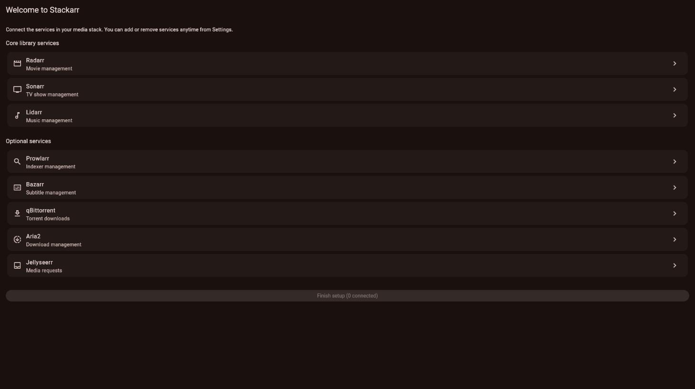
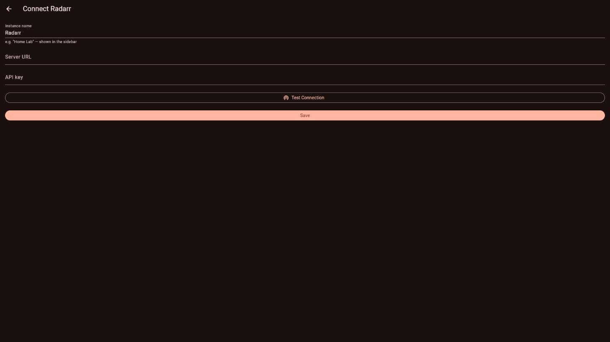
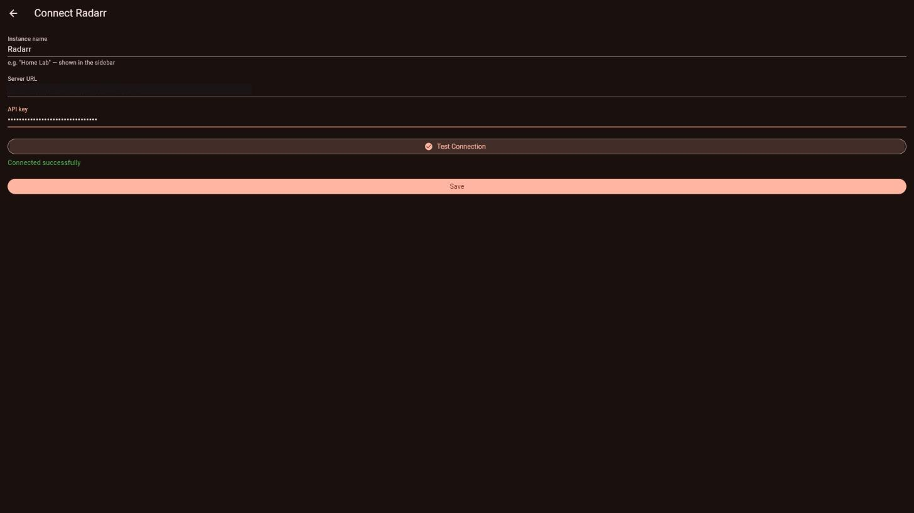
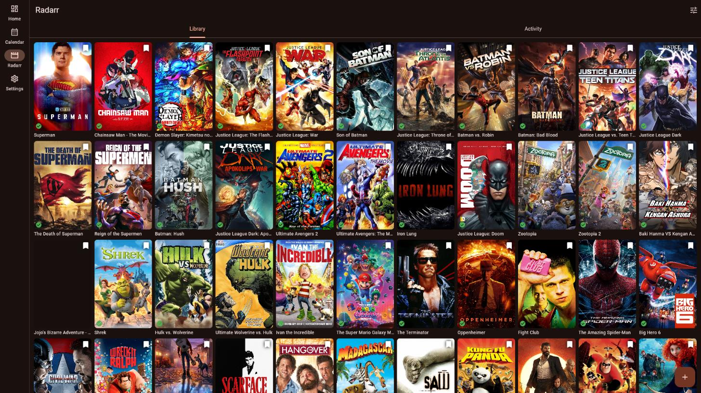
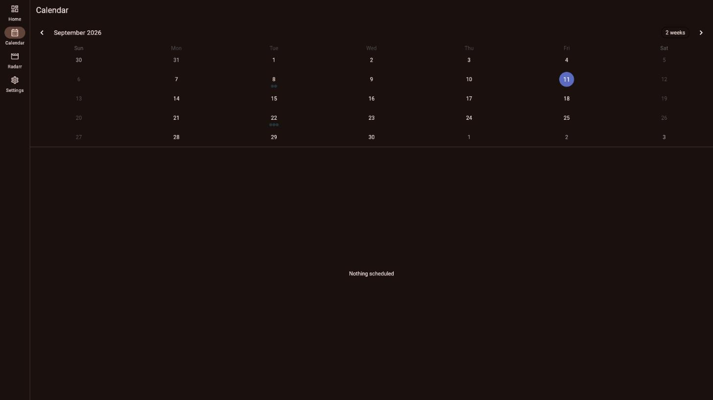

<p align="center">
  
</p>

<h1 align="center">Stackarr</h1>

<p align="center">
  <strong>A cross-platform Flutter app to manage your entire *arr media stack</strong>
</p>

<p align="center">
  <a href="https://github.com/abduznik/stackarr/releases"></a>
  <a href="https://github.com/abduznik/stackarr/blob/main/LICENSE"></a>
  
  <a href="https://github.com/abduznik/stackarr/stargazers"></a>
  <a href="https://github.com/abduznik/stackarr/issues"></a>
  <a href="https://github.com/sponsors/abduznik"></a>
</p>

<p align="center">
  <a href="#screenshots">Screenshots</a> •
  <a href="#features">Features</a> •
  <a href="#supported-services">Services</a> •
  <a href="#installation">Install</a> •
  <a href="#setup-wizard">Setup</a> •
  <a href="#contributing">Contributing</a> •
  <a href="#license">License</a>
</p>

---

**Stackarr** is a unified Flutter client for the *arr self-hosted media stack. One app to manage movies, TV shows, music, downloads, indexers, and subtitles — instead of opening 6 different web UIs on your phone.

## Why Stackarr?

The self-hosted media ecosystem runs on *arr apps (Radarr, Sonarr, Lidarr, Prowlarr, Bazarr...). Each has its own web UI. On desktop that's fine. On mobile it's painful — tiny tables, no touch optimization, and you need 6 bookmarks.

Existing mobile clients ([Ruddarr](https://github.com/ruddarr/app), [Seekarr](https://github.com/matthw-labs/seekarr), [Dashboarr](https://apps.apple.com/app/dashboarr/id6762170117)) cover Radarr + Sonarr and maybe Lidarr. **None of them cover the full stack.** Stackarr includes:

- **Prowlarr** — indexer management and sync
- **Bazarr** — subtitle management
- **qBittorrent / Aria2** — download client control
- **Jellyseerr** — request management (Overseerr planned)

Plus a **setup wizard** that walks you through connecting each service with auto-detection and health checks.

## Screenshots

All screenshots below are from a real build connected to a live Radarr instance — not mockups.

<table>
<tr>
<td><br/><sub>Setup wizard — pick which services to connect</sub></td>
<td><br/><sub>Connection form with live health check</sub></td>
</tr>
<tr>
<td><br/><sub>Test Connection succeeding against a real server</sub></td>
<td><br/><sub>Radarr library — real movies, posters, monitor state</sub></td>
</tr>
<tr>
<td colspan="2"><br/><sub>Unified calendar with real release dates</sub></td>
</tr>
</table>

## Features

- 🎬 **Movies** — Radarr library: browse, search, add, monitor, batch actions, quality profiles
- 📺 **TV Shows** — Sonarr library: series, seasons, episodes, per-episode monitor & search
- 🎵 **Music** — Lidarr library: artists, albums, monitor, batch actions
- 🔍 **Indexers** — Prowlarr: manage, test, sync indexers, connected-app overview
- 📝 **Subtitles** — Bazarr: wanted-subtitles across movies and episodes
- ⬇️ **Downloads** — qBittorrent (queue, pause/resume, speed limits) & Aria2 (active + history)
- 📬 **Requests** — Jellyseerr: browse/search catalog, submit new requests, approve/decline pending
- 📅 **Calendar** — Unified release calendar merging Radarr + Sonarr by day
- 🔐 **App Lock** — Optional PIN + biometric unlock, independent of any per-service login
- 🧙 **Setup Wizard** — Step-by-step connection guide with live health checks per service
- 📱✨ **Responsive UI** — Adaptive layout: navigation rail on desktop/tablet, bottom nav on phone
- 🌙 **Dark & Light Themes** — Adaptive Material 3 theming
- 🔒 **Local Only** — Connects to your servers directly, no cloud, no telemetry, credentials in OS-level secure storage

**Not yet built:** push notifications, Overseerr/Readarr/Whisparr, full quality-group editor (create/edit is supported; reordering nested quality groups is not), macOS/Linux/iOS builds. See [Roadmap](#roadmap).

## Supported Services

| Service | Purpose | API | Status |
|---------|---------|-----|--------|
| [Radarr](https://radarr.video/) | Movie management | v3 REST | ✅ Supported |
| [Sonarr](https://sonarr.tv/) | TV show management | v3 REST | ✅ Supported |
| [Lidarr](https://lidarr.audio/) | Music management | v3 REST | ✅ Supported |
| [Prowlarr](https://prowlarr.app/) | Indexer management | v1 REST | ✅ Supported |
| [Bazarr](https://www.bazarr.media/) | Subtitle management | REST | ✅ Supported |
| [qBittorrent](https://www.qbittorrent.org/) | Torrent downloads | Web API | ✅ Supported |
| [Aria2](https://aria2.github.io/) | Download management | JSON-RPC | ✅ Supported |
| [Jellyseerr](https://jellyseerr.dev/) | Media requests | REST | ✅ Supported |
| [Overseerr](https://overseerr.dev/) | Media requests | REST | 🔜 Planned |
| [Readarr](https://readarr.com/) | Book management | v3 REST | 🔜 Planned |
| [Whisparr](https://whisparr.com/) | Adult content | v3 REST | 🔜 Planned |

## Testing & Verification

Every supported service's API client has been verified against a real, live instance — not just mocked/fake data — confirming the app's requests and response parsing match what these servers actually return in production:

| Service | Live-verified | Notes |
|---------|---------------|-------|
| Radarr | ✅ | Movies, quality profiles, calendar, lookup, queue |
| Sonarr | ✅ | Series, seasons, episodes, quality profiles, queue |
| Lidarr | ✅ | Artists, albums, quality profiles, queue |
| Prowlarr | ✅ | Indexers, connected applications |
| Bazarr | ✅ | Wanted movies/episodes — a real field-name mismatch (`episodeTitle` vs. an assumed `episode_title`) was found and fixed this way |
| qBittorrent | ✅ | Torrents, transfer info — a real auth bug (missing `Referer` header, silently rejected behind a reverse proxy) was found and fixed this way |
| Jellyseerr | ✅ | Requests inbox, search/discover |
| Aria2 | ⚠️ Client code reviewed, not live-tested (the only available test instance was unreachable — a `502` from its reverse proxy, unrelated to this app) |

On top of live verification, the full suite includes 80+ automated tests: widget tests for every screen, unit tests for parsing/business logic, and HTTP-contract tests (mocked `http.Client`) asserting the exact wire format sent to each service. UI responsiveness (NavigationRail vs. bottom nav, desktop/tablet landscape vs. phone portrait) is covered by dedicated layout tests. Run everything yourself with:

```bash
flutter test
flutter analyze
```

## Installation

### Android
Download the latest `.apk` from [Releases](https://github.com/abduznik/stackarr/releases) and sideload it. Currently signed with a debug key (no Play Store distribution yet) — Android will warn you before installing an app from outside the Store, which is expected.

### Windows
Download and unzip the latest `stackarr-windows.zip` from [Releases](https://github.com/abduznik/stackarr/releases), then run `stackarr.exe`.

### iOS, macOS, Linux, Web
Not built or published yet — see [Roadmap](#roadmap). Web compiles (`flutter build web`) and runs correctly in debug mode (the screenshots above were captured that way), but the optimized release build currently crashes on startup — a real, unresolved bug, not yet root-caused. Don't rely on `flutter build web`'s release output until this is fixed.

### Build from Source
```bash
git clone https://github.com/abduznik/stackarr.git
cd stackarr
flutter pub get
flutter run                    # auto-detects platform
flutter run -d chrome          # web
flutter build apk              # Android
flutter build windows          # Windows
```

**Requirements:** Flutter 3.24+, Dart 3.5+

## Setup Wizard

First launch opens the wizard:

```
Step 1: Name your instance (e.g., "Home Lab")
Step 2: Enter Radarr URL + API key → Auto-detect + health check ✓
Step 3: Enter Sonarr URL + API key → Auto-detect + health check ✓
Step 4: Enter Lidarr URL + API key → Auto-detect + health check ✓
Step 5: (Optional) Prowlarr, Bazarr, qBittorrent, Jellyseerr...
Step 6: All services connected! 🎉
```

Each step validates the connection before moving on. Add or remove services anytime in Settings.

Multiple instances supported — manage your home lab and your friend's from one app.

## Roadmap

**Done:**
- [x] Unified calendar (Radarr + Sonarr)
- [x] Batch operations (multi-select monitor/search/delete for Movies, TV, Music)
- [x] Quality profile management (view, edit, duplicate, delete)
- [x] App-level PIN + biometric lock
- [x] Responsive desktop/tablet/phone layouts

**Known issues:**
- [ ] Web release build (`flutter build web`) crashes on startup — debug mode works fine, root cause not yet identified

**Planned:**
- [ ] Live-verify Aria2 against a real instance (blocked on a reachable test server)
- [ ] Push notifications (FCM / local) for completed downloads, new episodes, failed grabs
- [ ] Overseerr, Readarr, Whisparr support
- [ ] Full quality-group editor (create/reorder nested quality groups, not just duplicate/edit existing profiles)
- [ ] Signed Android release build (currently debug-signed)
- [ ] macOS, Linux, iOS, and Web builds added to the release pipeline
- [ ] Widget support (Android/iOS)
- [ ] Shortcuts / quick actions

## Contributing

Contributions welcome! Check the [issues](https://github.com/abduznik/stackarr/issues) for good first issues.

```bash
# Fork, then:
git checkout -b feature/my-feature
flutter test
flutter analyze
```

## Acknowledgments

Built on the shoulders of:
- [Servarr](https://wiki.servarr.com/) — the *arr project ecosystem and API documentation
- [Ruddarr](https://github.com/ruddarr/app) — native iOS Radarr/Sonarr client
- [Seekarr](https://github.com/matthw-labs/seekarr) — Flutter multi-service client
- [Dashboarr](https://apps.apple.com/app/dashboarr/id6762170117) — iOS arr companion

## License

[MIT](LICENSE) — use it, fork it, ship it.

---

<p align="center">
  <a href="https://github.com/sponsors/abduznik"></a>
</p>
